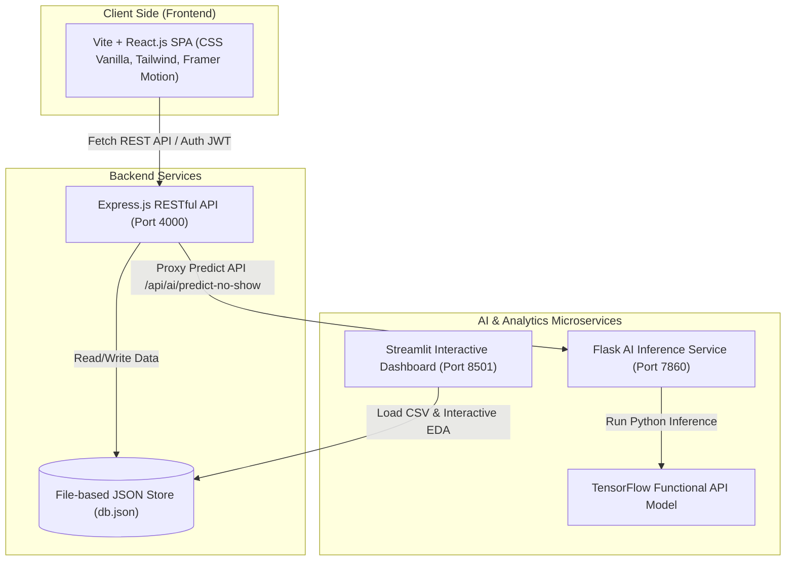

# 🏥 HealPoint: Sistem Layanan Kesehatan Terintegrasi Berbasis AI dan Real-Time

[](https://www.dbs.com/)
[](https://github.com/)
[](https://github.com/)
[](https://www.tensorflow.org/)
[](https://react.dev/)

---

## 🌟 1. Ringkasan Eksekutif & Latar Belakang

Akses terhadap pelayanan kesehatan yang cepat, akurat, dan transparan masih menjadi tantangan besar di Indonesia. Masalah utama yang sering dihadapi masyarakat adalah ketidakpastian informasi mengenai ketersediaan dokter, antrian yang membludak di fasilitas kesehatan, serta prosedur birokrasi yang memakan waktu lama. Di sisi lain, fasilitas kesehatan kehilangan pendapatan dan efisiensi operasional akibat tingginya tingkat *no-show* (pasien yang tidak hadir pada jadwal appointment yang sudah dibuat), yang secara global mencapai **15–30%** dari total appointment terjadwal.

Menjawab tantangan tersebut, **HealPoint** hadir sebagai platform ekosistem layanan kesehatan digital yang dirancang sebagai solusi *"one-stop health service"* terintegrasi. HealPoint memungkinkan pasien menemukan fasilitas kesehatan dan dokter terdekat, membuat reservasi jadwal secara online, dan menerima prediksi risiko *no-show* berbasis AI secara real-time.

Model *Deep Learning* yang kami kembangkan menggunakan **TensorFlow Functional API** menganalisis faktor demografis, kondisi kesehatan, jarak waktu tunggu, dan lokasi untuk memprediksi kemungkinan ketidakhadiran pasien. Hal ini memungkinkan administrasi fasilitas kesehatan memberikan pengingat yang tepat sasaran dan mengalokasikan slot jadwal secara lebih efisien.

---

## 👥 2. Anggota Tim Capstone (CC26-PSU389)

Kami adalah tim lintas disiplin yang berkolaborasi dalam mewujudkan HealPoint dari tahap analisis data hingga produk siap pakai:

| Nama Anggota | ID Anggota | Peran / Fokus Utama | status |
| :--- | :--- | :--- | :--- |
| **Hasbi Nurwahid** | CDCC222D6Y0401 | **Data Scientist** (Gathering, assessing, & cleaning data, analisis pola, dataset preparation) | Aktif |
| **Yan Syafiq Albari** | CDCC222D6Y2284 | **Data Scientist** (EDA, visualisasi, Streamlit dashboard, data dictionary, insights) | Aktif |
| **M. Nur Daffa** | CACC222D6Y2621 | **AI Engineer** (Pengembangan model TensorFlow, training, evaluasi, custom components) | Aktif |
| **M. Adam Sirojuddin** | CACC222D6Y071 | **AI Engineer** (Export model, inference script, Flask AI service integration, optimasi) | Non Aktif |
| **Muhammad Alan Andika** | CFCC299D6Y2464 | **Full-Stack Developer** (Frontend React.js, Smart Scheduling UI, geolocation hub, API integration) | Aktif |
| **Eko Wahyudi** | CFCC525D6Y0109 | **Full-Stack Developer** (Backend Express.js, JWT Auth, database, appointment management, proxy AI) | Aktif |

---

## 🚀 3. Fitur Utama Platform

1. **Smart Scheduling & AI No-show Predictor**: Setiap appointment baru yang dibuat langsung diproses oleh model AI TensorFlow untuk menghasilkan probabilitas ketidakhadiran, tingkat risiko (Low, Medium, High), serta rekomendasi tindakan intervensi bagi pihak administrasi rumah sakit.
2. **Geolocation Health Hub**: Memudahkan pasien mencari fasilitas kesehatan terdekat (Rumah Sakit, Klinik, Puskesmas) dan dokter berdasarkan lokasi, jarak, dan spesialisasi medis.
3. **Personal Health Data Ledger**: Rekam medis digital pribadi (Personal Health Record) yang tersimpan aman untuk memantau riwayat janji temu dan diagnosa dokter.
4. **Admin Analytics Dashboard**: Dashboard untuk manajemen faskes untuk melacak volume reservasi, performa dokter, *no-show rate* bulanan, serta distribusi tingkat risiko pasien.
5. **Interactive Explanatory Dashboard (Streamlit)**: Dashboard analisis data terpisah yang memfasilitasi visualisasi data interaktif 6-tab berdasarkan 5 *business questions* utama untuk membantu pengambilan keputusan berbasis data.

---

## 🛠 4. Tech Stack & Arsitektur Sistem

Aplikasi dirancang menggunakan arsitektur modular (*Separation of Concerns*) sehingga pengembangan, pemeliharaan, dan scaling masing-masing komponen dapat dilakukan secara independen.



### Rincian Teknologi:
- **Frontend**: React (Vite, React Router v7, Framer Motion, Vanilla CSS, Tailwind CSS, Leaflet Map).
- **Backend API**: Node.js & Express.js (JWT Authentication, Morgan logger, bcryptjs, CORS).
- **AI Microservice**: Python & Flask (Inference Engine, Gunicorn).
- **AI/ML Engine**: TensorFlow 2.x (Keras Functional API, Custom Layers, Custom Callbacks, Custom Loss).
- **Data Dashboard**: Streamlit (Pandas, Recharts/Matplotlib visualisasi).
- **Database**: File-based JSON Store (`db.json`) sebagai persistent database yang ringan dan portabel untuk MVP.

---

## 📁 5. Struktur Direktori Proyek

```text
HealPoint/
├── projectbrief_healpoint.md        # Dokumen Brief Capstone Project
├── README.md                        # Dokumentasi Utama Repository (ini)
│
├── datascientist/                  # PENGEMBANGAN DATA SCIENCE (DS-1 & DS-2)
│   ├── data/
│   │   ├── raw/                    # Dataset mentah dari Kaggle
│   │   ├── cleaned/                # Dataset hasil pembersihan tahap awal
│   │   └── processed/              # Dataset bersih akhir untuk Dashboard
│   ├── notebooks/
│   │   ├── 01_gathering_data.ipynb
│   │   ├── 02_assessing_cleaning.ipynb
│   │   ├── 03_eda_visualization.ipynb
│   │   └── 04_feature_engineering.ipynb
│   ├── dashboard/
│   │   └── streamlit_app.py        # Kode Aplikasi Dashboard Streamlit
│   ├── data_dictionary.md          # Kamus data rinci (20 kolom)
│   ├── final_dataset.csv           # Output dataset siap latih model AI
│   └── src_prepare_dataset.py      # Pipeline pemrosesan dataset otomatis
│
├── ai engineer/                    # PENGEMBANGAN ARTIFICIAL INTELLIGENCE (AI-1 & AI-2)
│   ├── Dockerfile                  # Containerization untuk AI Service
│   ├── requirements.txt            # Dependency Python untuk ML
│   ├── model/                      # Modul & Asset Model Produksi
│   │   ├── custom_callback.py      # Callback kustom (StopAtAuc)
│   │   ├── custom_layer.py         # Layer kustom (RiskCalibrationLayer)
│   │   ├── custom_loss.py          # Loss kustom (FocalBinaryCrossentropy)
│   │   ├── inference.py            # Script proses prediksi & rekomendasi
│   │   ├── train_model.py          # Script utama training model TensorFlow
│   │   └── training_metrics.txt    # Hasil evaluasi model (ROC-AUC, F1-Score)
│   ├── models/                     # Tempat ekspor file model (.keras & .pkl)
│   └── reports/                    # Model Card dan laporan evaluasi
│
└── fullstack/                      # PENGEMBANGAN WEB FULL-STACK (FS-1 & FS-2)
    ├── docs/
    │   └── api-contract.md         # Dokumentasi Kontrak RESTful API
    ├── backend/                    # Express.js REST API
    │   ├── app.js                  # Entry point lokal backend
    │   ├── package.json
    │   ├── ai-service/             # Flask microservice proxy
    │   │   ├── app.py              # Flask Server endpoint /predict
    │   │   └── requirements.txt
    │   └── src/
    │       ├── app.js              # Routing & middleware setup
    │       ├── server.js           # Express listener
    │       ├── controllers/        # Logika handler faskes, appointment, auth, dll.
    │       ├── middleware/         # Autentikasi JWT & Role authorization
    │       ├── routes/             # RESTful Routes definition
    │       └── data/               # Persistent JSON storage (db.json)
    └── frontend/                   # React Single Page Application (SPA)
        ├── package.json
        ├── index.html
        ├── vite.config.js
        └── src/                    # Source Code React
            ├── App.jsx             # Root router & layouts
            ├── main.jsx            # Entry point rendering DOM
            ├── api.js              # Client API wrapper (Fetch API native)
            ├── components/         # Komponen reusable (Card, Badges, Header, dll.)
            ├── pages/              # Halaman Dashboard (User, Admin, Login, Landing)
            └── styles/             # Stylesheet terstruktur (landing, dashboard, dll.)
```

---

## 🏁 6. Panduan Menjalankan Aplikasi Secara Lokal

Ikuti langkah-langkah di bawah ini secara berurutan untuk menjalankan seluruh ekosistem HealPoint di komputer Anda.

### Prasyarat (Prerequisites)
Pastikan Anda sudah menginstal:
- [Node.js](https://nodejs.org/) (Versi 18 atau lebih baru)
- [Python](https://www.python.org/) (Versi 3.9 s/d 3.11 direkomendasikan)
- [Git](https://git-scm.com/)

---

### Langkah 1: Kloning Repositori & Persiapan Awal
```bash
git clone https://github.com/your-username/HealPoint.git
cd HealPoint
```

---

### Langkah 2: Jalankan Pipeline Persiapan Data (Data Science)
Dataset mentah `KaggleV2-May-2016.csv` perlu dibersihkan dan diproses terlebih dahulu untuk menghasilkan dataset siap pakai:
```bash
# Menjalankan pemrosesan otomatis
python datascientist/src_prepare_dataset.py
```
*Script ini akan secara otomatis melakukan cleaning, merapikan tipe data, dan menghasilkan file:*
* `datascientist/data/processed/appointments_clean.csv` (untuk Dashboard)
* `ai engineer/data/model_input/appointments_model_ready.csv` (untuk training AI)
* `fullstack/backend/src/data/appointments_sample.json` (untuk seed database lokal)

---

### Langkah 3: Jalankan Dashboard Analisis Streamlit
```bash
# Install dependency data science (direkomendasikan dalam virtual environment)
pip install pandas streamlit matplotlib seaborn jinja2

# Jalankan server Streamlit
streamlit run datascientist/dashboard/streamlit_app.py
```
Dashboard dapat diakses secara lokal di **`http://localhost:8501`**.

---

### Langkah 4: Latih Model AI TensorFlow (Opsional)
Jika Anda ingin melatih ulang model Deep Learning dari awal menggunakan dataset hasil olahan Data Scientist:
```bash
cd "ai engineer"
pip install -r requirements.txt
python model/train_model.py
```
*Proses ini akan menghasilkan model terkalibrasi `healpoint_no_show_model.keras` dan file preprocessor `preprocessor.pkl` di dalam folder `ai engineer/models/` serta mencatat performa evaluasi.*

---

### Langkah 5: Jalankan AI Inference Flask Service
Inference service berjalan sebagai server microservice independen dengan Flask:
```bash
cd fullstack/backend/ai-service
pip install -r requirements.txt
python app.py
```
*Server AI Service akan aktif pada port **7860** (`http://localhost:7860`).*

---

### Langkah 6: Jalankan Backend Express.js
Buka terminal baru pada root proyek HealPoint:
```bash
cd fullstack/backend
npm install
npm run start
```
*Server API Backend akan aktif pada port **4000** (`http://localhost:4000`). Anda dapat memantau endpoint kesehatan melalui `http://localhost:4000/api/health`.*

---

### Langkah 7: Jalankan Frontend React (Vite)
Buka terminal baru lagi pada root proyek HealPoint:
```bash
cd fullstack/frontend
npm install
npm run dev
```
*Aplikasi web Frontend akan aktif di browser pada alamat **`http://localhost:5173`**.*

---

## 🧠 7. Spesifikasi Teknis Model AI (Model Card)

Model AI HealPoint didesain secara khusus untuk menjawab tantangan ketidakhadiran pasien (*no-show*) dengan pendekatan klasifikasi biner berbasis Deep Learning.

### 📊 Dataset Ringkasan
- **Nama Sumber**: [Kaggle No-show Appointments Dataset](https://www.kaggle.com/datasets/joniarroba/noshowappointments) (110.527 janji medis nyata).
- **Karakteristik Kelas**: Sangat tidak seimbang (*Imbalanced Class*), di mana **~80%** pasien hadir (*Show*) dan **~20%** tidak hadir (*No-show*).
- **Fitur Input**: Umur, Gender, Neighbourhood (Lokasi), Hari Registrasi vs Hari Appointment, Waiting Days, SMS Received, Kondisi Kronis (Diabetes, Hipertensi, Alkoholisme, Handicap), Status Beasiswa (Scholarship).

### 🛠 Tiga Komponen Kustom TensorFlow (TensorFlow Custom Components)
Untuk mengatasi tantangan teknis dataset dan performa keputusan bisnis, tim AI Engineer mengimplementasikan tiga komponen kustom Keras yang terdaftar secara serial:

1. **`FocalBinaryCrossentropy` (Custom Loss Function)**:
   - **Tantangan**: Model standar cenderung bias ke mayoritas kelas (*Show* / Pasien Hadir) karena ketimpangan data 80:20.
   - **Solusi**: Mengganti loss standar dengan Focal Loss untuk klasifikasi biner. Komponen ini menurunkan bobot kehilangan (loss weight) untuk contoh yang mudah diklasifikasikan dan memfokuskan pembelajaran pada contoh yang sulit (kasus no-show), meningkatkan sensitivitas prediksi terhadap ketidakhadiran pasien secara signifikan.
2. **`RiskCalibrationLayer` (Custom Layer)**:
   - **Tantangan**: Output dari layer sigmoid seringkali terlalu ekstrem (sangat mendekati 0 atau 1) dan kurang mencerminkan probabilitas aktual untuk dasar keputusan alokasi slot dinamis.
   - **Solusi**: Custom layer diletakkan setelah sigmoid yang melakukan kompresi skala linear dan pembatasan nilai (*clipping*) secara dinamis dalam batas presisi valid `[0.0, 1.0]`, menghasilkan probabilitas prediksi yang lebih halus untuk diinterpretasikan sebagai tingkat risiko (Low / Medium / High) oleh Admin Faskes.
3. **`StopAtAuc` (Custom Callback)**:
   - **Tantangan**: Akurasi dasar (Accuracy) sering menipu pada data imbalanced. Early stopping biasa berbasis akurasi akan berhenti terlalu cepat saat model baru mempelajari kelas mayoritas.
   - **Solusi**: Menghentikan proses training model secara dinamis saat metrik **ROC-AUC** pada data validasi telah mencapai target performa optimal yang optimal (`AUC >= 0.78`), memastikan model tidak mengalami overfitting dan memiliki kemampuan generalisasi yang tinggi.

### 📈 Metrik Evaluasi Model Akhir
Model berhasil dievaluasi menggunakan pembagian data *stratified split* (80% Train, 20% Test):
- **ROC-AUC Score**: **`0.7831`** (Menunjukkan performa klasifikasi yang handal dan stabil).
- **F1-Score untuk Kelas No-show**: Meningkat signifikan dibanding model dasar berkat *Focal Loss*.
- **Output Inferensi**: Mengembalikan JSON berisi `no_show_probability`, `risk_level` (Low/Medium/High), dan rekomendasi intervensi (seperti prioritas kirim pesan teks personal, konfirmasi telepon H-1, atau penataan antrian dinamis).

---

## 📊 8. Analisis Data & Insight Bisnis (Data Science)

Tahap analisis eksploratori (EDA) dalam Jupyter Notebook dan visualisasi interaktif pada Dashboard Streamlit berhasil menjawab **5 Pertanyaan Bisnis** utama:

1. **BQ1: Tingkat No-show Overall**
   - **Temuan**: Rata-rata tingkat no-show di seluruh fasilitas kesehatan adalah sekitar **20.2%**. Artinya, 1 dari 5 janji temu yang dijadwalkan berakhir sia-sia karena ketidakhadiran pasien tanpa pembatalan awal.
2. **BQ2: Pengaruh Jeda Waktu Tunggu (Waiting Days)**
   - **Temuan**: Pasien yang memesan jadwal di hari yang sama (*Same day*) memiliki tingkat no-show yang sangat rendah (~4.6%). Namun, jika jeda waktu tunggu melebihi 15 hari, tingkat no-show melonjak tajam hingga **~32%**, dan meningkat lebih dari **38%** jika waktu tunggu lebih dari 30 hari. 
   - **Insight**: Semakin lama jeda waktu, semakin besar kemungkinan pasien lupa atau urusannya berubah. Kelompok waktu tunggu panjang wajib diberi intervensi intensif.
3. **BQ3: Kelompok Usia yang Berisiko**
   - **Temuan**: Pasien remaja dan dewasa muda (usia 15–30 tahun) menunjukkan tingkat ketidakhadiran paling tinggi (mencapai **~24-25%**). Sebaliknya, pasien lanjut usia di atas 60 tahun sangat disiplin dengan tingkat ketidakhadiran di bawah **~15%**.
4. **BQ4: Wilayah Prioritas Intervensi (Neighbourhood)**
   - **Temuan**: Ditemukan variasi spasial yang lebar di mana beberapa wilayah seperti *Santos Dumont* dan *Santa Cecilia* memiliki tingkat no-show di atas **28%**, sedangkan wilayah faskes lain berada di bawah 15%. Analisis ini membantu alokasi tim lapangan untuk sosialisasi atau prioritas reminder.
5. **BQ5: Efektivitas SMS Reminder**
   - **Temuan**: Data mentah menunjukkan paradoks di mana pasien yang menerima SMS pengingat justru memiliki persentase no-show yang cukup tinggi. Hal ini dikarenakan SMS mayoritas hanya dikirimkan kepada pasien dengan jeda waktu tunggu lama (korelasi bias). Setelah dikontrol, SMS terbukti menekan angka ketidakhadiran pada kelompok tunggu sedang (3-7 hari).

---

## 🛡 9. Analisis SWOT Proyek

### **Kekuatan (Strengths)**
- **Solusi Terintegrasi End-to-End**: Menghubungkan kebutuhan pasien (kemudahan reservasi faskes) dan kebutuhan faskes (dashboard prediktif) dalam satu kesatuan sistem.
- **Model Deep Learning Mutakhir**: Mengatasi bias class imbalance dengan *Focal Loss* serta dilengkapi kalibrasi probabilitas dan early stopping berbasis metrik representatif (AUC).
- **Arsitektur Modular**: Desain decoupled meminimalkan efek domino jika salah satu layanan down dan mempercepat iterasi pengembangan faskes.

### **Kelemahan (Weaknesses)**
- **Keterbatasan Asal Dataset**: Data acuan berasal dari historis pasien Brasil (Kaggle), yang pola perilakunya bisa berbeda dengan pola perilaku pasien di Indonesia. Retraining dengan data lokal mutlak diperlukan sebelum go-live.
- **Persistensi File JSON**: Penyimpanan `db.json` sangat cocok untuk skalabilitas demonstrasi MVP, namun kurang efisien dari sisi konkurensi data jika diakses ribuan pengguna bersamaan.

### **Peluang (Opportunities)**
- **Akselerasi Digitalisasi Nasional**: Didorong oleh regulasi SatuSehat Kemenkes dan tingginya penetrasi mobile internet di Indonesia untuk mengadopsi solusi operasional faskes yang cerdas.
- **Urgensi Efisiensi Operasional**: Klinik swasta dan Puskesmas memiliki motivasi finansial yang tinggi untuk menekan angka *no-show* demi efektivitas waktu dokter dan alokasi obat.

### **Ancaman (Threats)**
- **Kompetitor Raksasa**: Platform Health-tech mapan (Halodoc, Alodokter) dapat dengan mudah menyalin fitur prediksi no-show jika mereka mulai melirik model integrasi operasional B2B faskes fisik.
- **Regulasi Keamanan Data (UU PDP)**: Kepatuhan tinggi terhadap privasi data medis pasien yang sangat ketat di Indonesia, memerlukan investasi audit enkripsi database yang masif.

---

## 🗺 10. Rencana Implementasi & Ekspansi (3–6 Bulan ke Depan)

Sebagai ekspansi strategis, HealPoint dirancang untuk dipasarkan dengan skema **B2B (Business-to-Clinic/Hospital)** bertajuk *Smart Clinic Operations Platform*:

- **Fase 1 (Bulan 1–2): Penguatan Infrastruktur & Integrasi Notifikasi**
  * Migrasi database dari file JSON ke sistem database relasional skala produksi (PostgreSQL/SQLite) untuk menangani multi-request secara aman.
  * Mengintegrasikan WA/SMS API Gateway otomatis yang terpicu langsung ketika model memprediksi pasien masuk kategori risiko *High*.
- **Fase 2 (Bulan 3–4): Pilot Project & Retraining Model Lokal**
  * Melakukan uji coba terbatas (*Pilot Project*) pada 2–3 jaringan klinik lokal di Jabodetabek.
  * Mengumpulkan data transaksi booking organik lokal Indonesia untuk merestrukturisasi fitur dan melatih kembali (*retrain*) model agar lebih akurat terhadap perilaku pasien domestik.
- **Fase 3 (Bulan 5–6): Scaling & Otomatisasi MLOps**
  * Membangun pipeline retraining otomatis (MLOps) untuk menguji model secara berkala dengan data baru.
  * Integrasi Google Maps API untuk fitur visualisasi rute terdekat secara presisi bagi pasien dan penyusunan sistem antrean digital real-time.

---

## 🔗 11. Tautan Proyek (Project Links)

*   **Tautan Dataset (Kaggle)**: [Kaggle No-show Appointments](https://www.kaggle.com/datasets/joniarroba/noshowappointments)
*   **Deployment Web (Frontend)**: `[Tautan Vercel Anda]`
*   **Deployment API Backend**: `[Tautan Render / Heroku Backend Anda]`
*   **Deployment AI Service**: `[Tautan Railway / Hugging Face Spaces Anda]`
*   **Deployment Dashboard (Streamlit)**: `[Tautan Streamlit Share Anda]`
*   **Repository GitHub**: `[Tautan GitHub Project]`
*   **Video Presentasi (Pitching 10 Menit)**: `[Tautan YouTube]`
*   **Panduan Penggunaan Produk**: `[Tautan Demo / Dokumentasi Panduan]`
*   **Tautan Slide Presentasi**: `[Tautan Google Slides / Canva]`

---

> **Note**: Proyek ini dibangun dari nol (*from scratch*) sebagai tugas akhir Capstone Project dalam program **Coding Camp 2026 powered by DBS Foundation**. Seluruh kriteria fungsionalitas utama (*Main Quests*) telah terpenuhi 100% dengan performa optimal.
