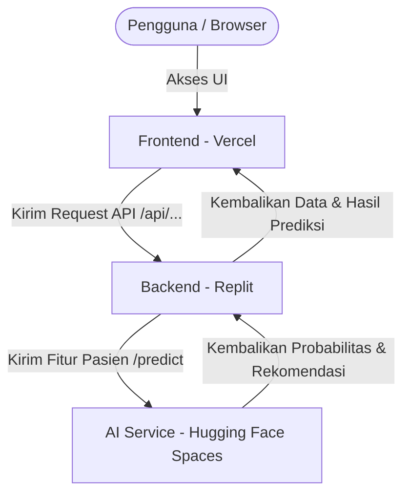

# Panduan Integrasi & Penyebaran (Deployment Guide) - HealPoint Fullstack

Panduan ini menjelaskan langkah demi langkah untuk menghubungkan ketiga komponen platform **HealPoint**:
1. **AI Service** (Sudah berjalan di Hugging Face Spaces)
2. **Backend API** (Akan di-deploy di Replit)
3. **Frontend Dashboard** (Akan di-deploy di Vercel)

---

## Arsitektur Koneksi Sistem

Berikut adalah bagaimana data mengalir di antara ketiga layanan setelah di-deploy:

---

## Langkah 1: Deploy Backend di Replit

Komponen **Backend** mengelola data jadwal dokter, janji temu medis, rekam medis pasien, enkripsi password, autentikasi JWT, serta meneruskan data ke AI Model di Hugging Face.

### 1.1 Persiapan Project di Replit
1. Masuk ke akun [Replit](https://replit.com/).
2. Buat Repl baru dengan memilih template **Node.js**.
3. Beri nama Repl Anda, misalnya `healpoint-backend`.
4. Unggah seluruh isi folder `fullstack/backend` ke Repl baru tersebut (pastikan struktur folder backend berada di root direktori Repl).

### 1.2 Konfigurasi Environment Variables (Secrets) di Replit
Buka tab **Tools** > **Secrets** (atau ikon Gembok) di panel samping kiri Replit, lalu tambahkan variabel berikut:

| Key | Value | Keterangan |
| :--- | :--- | :--- |
| `AI_SERVICE_URL` | `https://hilman1237050020-healthpoint.hf.space` | URL API Hugging Face Spaces Anda (tanpa akhiran `/predict`) |
| `JWT_SECRET` | `isi_dengan_string_acak_dan_aman` | Kunci rahasia untuk enkripsi token login JWT |

> [!IMPORTANT]
> Pastikan URL `AI_SERVICE_URL` menggunakan subdomain `.hf.space` langsung (bukan format URL antarmuka Spaces biasa). Format yang benar adalah: `https://hilman1237050020-healthpoint.hf.space`.

### 1.3 Menjalankan Backend
1. Jalankan perintah `npm install` di shell Replit jika dependensi belum terpasang otomatis.
2. Klik tombol **Run** (atau jalankan `npm start` di shell).
3. Replit akan membuka tab web browser mini dengan URL aplikasi backend Anda. Format URL biasanya berupa:
   `https://healpoint-backend.username.repl.co` atau `https://healpoint-backend.username.replit.app`
4. Catat URL backend ini, karena akan digunakan pada konfigurasi Frontend di Vercel.

---

## Langkah 2: Deploy Frontend di Vercel

Komponen **Frontend** adalah antarmuka web interaktif berbasis React & Vite tempat pasien dan admin berinteraksi langsung.

### 2.1 Persiapan Kode di GitHub (Direkomendasikan)
1. Inisialisasi Git di dalam direktori `fullstack/frontend` Anda dan hubungkan ke repositori GitHub pribadi Anda.
2. Push seluruh kode di folder `frontend` ke repositori tersebut.
   *(Pastikan file `.gitignore` menyertakan `node_modules` dan file `.env` lokal agar tidak ikut terunggah).*

### 2.2 Import Project di Vercel
1. Masuk ke dashboard [Vercel](https://vercel.com/).
2. Klik tombol **Add New** > **Project**.
3. Hubungkan akun GitHub Anda dan pilih repositori `healpoint-frontend` yang baru saja di-push.
4. Pada bagian **Configure Project**:
   - **Framework Preset**: Pilih **Vite** (Vercel biasanya mendeteksinya secara otomatis).
   - **Root Directory**: Jika repositori Anda menampung monorepo (ada folder frontend dan backend terpisah), atur **Root Directory** ke folder `frontend`. Jika hanya berisi kode frontend, biarkan default (`./`).

### 2.3 Konfigurasi Environment Variables di Vercel
Sebelum mengklik **Deploy**, buka menu dropdown **Environment Variables** di Vercel dan tambahkan konfigurasi berikut:

| Key | Value | Keterangan |
| :--- | :--- | :--- |
| `VITE_API_BASE` | `https://healpoint-backend.username.replit.app` | **Ganti dengan URL Backend Replit Anda** yang dicatat dari Langkah 1.3 |
| `VITE_OPENROUTER_API_KEY` | `sk-or-v1-xxx...` | *(Opsional)* API Key dari OpenRouter jika ingin mengaktifkan fitur AI Consultant Chat |

> [!TIP]
> Jika Anda mengubah atau memperbarui backend di kemudian hari, Anda cukup mengubah nilai `VITE_API_BASE` di panel pengaturan Vercel dan melakukan *re-deploy* project frontend.

### 2.4 Jalankan Deployment
1. Klik tombol **Deploy**.
2. Tunggu proses build selesai (sekitar 1-2 menit).
3. Selamat! Vercel akan memberikan URL publik untuk aplikasi web HealPoint Anda, misalnya: `https://healpoint-frontend.vercel.app`.

---

## Langkah 3: Verifikasi Integrasi Akhir

Setelah kedua layanan aktif, buka URL frontend Vercel Anda di browser dan lakukan verifikasi berikut:

1. **Koneksi Frontend-to-Backend**:
   - Buka menu pendaftaran/login, buat akun baru. Jika berhasil masuk ke Dashboard Pasien, berarti Frontend Vercel telah terhubung dengan database `db.json` milik Backend Replit.
2. **Koneksi Backend-to-AI Service**:
   - Coba buat sebuah janji temu medis (*medical appointment*).
   - Saat janji temu dibuat, Backend secara otomatis mengirim data janji temu tersebut ke Hugging Face AI Service Anda untuk menilai probabilitas absen janji temu (*no-show risk*).
   - Periksa apakah indikator tingkat risiko (Low / Medium / High Risk) muncul di daftar janji temu Anda. Jika muncul tanpa ada peringatan *"fallback used"*, integrasi berjalan sempurna!

---
*Dokumen ini dibuat secara otomatis untuk membantu tim developer HealPoint dalam proses rilis MVP.*
